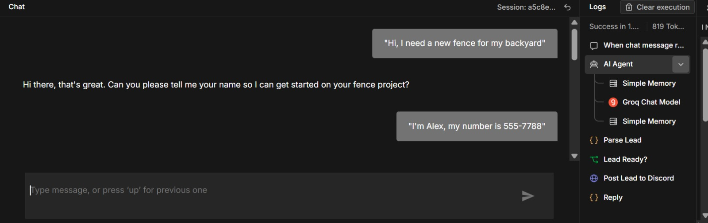
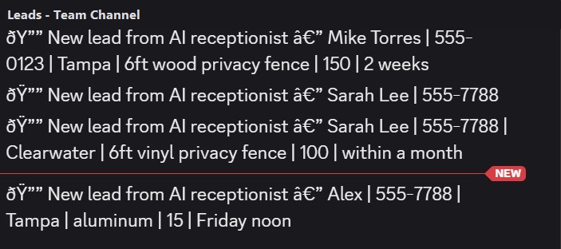
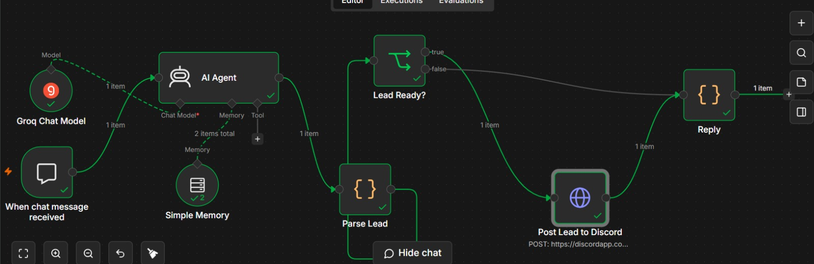

# AI Receptionist for Home-Services Businesses

A **24/7 AI assistant** built in n8n that chats with website visitors, qualifies leads, and instantly alerts the team — so a fence / home-services company never misses an after-hours inquiry again.

> ⚠️ Demo data is fictional. Webhook URLs and credentials are placeholders. Built as a reusable solution.

---

## What it does

- 💬 **Greets & answers customers 24/7** — natural back-and-forth, not a clunky form
- 🎯 **Qualifies the lead** — name, phone, location, fence type, length, timeline
- 🔔 **Instantly alerts the team** — pushes qualified leads to Discord / Slack / WhatsApp
- 🧩 **Runs alongside the existing system** — low-risk, nothing to replace

## See it working

| The AI chats & captures the lead | Qualified leads hit the team channel |
|---|---|
|  |  |

**The full automation (n8n):**



> Demo data is fictional.

## How it works

```
Customer message → AI Agent (LLM) → Parse & structure → Lead ready? ──► Alert the team
                                                              └────────► Reply to customer
```

**Design highlight:** the AI returns a structured JSON object each turn (reply + extracted lead
fields + a `lead_ready` flag). Downstream nodes handle the logic and notification. The AI focuses
on conversation; the automation handles the actions — far more reliable than a free-form agent.

## Tech

n8n · LLM chat model · conversation memory · structured JSON extraction · webhook alerts

## Files

| File | Description |
|------|-------------|
| `CASE-STUDY.md` | Full problem → solution → impact writeup |
| `AI-Receptionist-CaseStudy.pdf` | One-page visual case study (with screenshots) |
| `workflows/ai-receptionist.json` | The n8n workflow (sanitized, importable) |

## Try it

1. Import `workflows/ai-receptionist.json` into n8n
2. Add your own LLM credential (replace the placeholder credential ID)
3. Replace `REPLACE-WITH-YOUR-WEBHOOK-URL` with your Discord/Slack/WhatsApp webhook
4. Open the chat and say hello 👋
